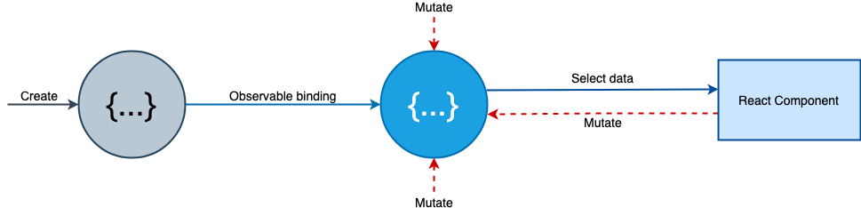

English | [简体中文](./README.zh-CN.md)

<div align="center">
  <h1><code>hodux</code></h1>
  <p><strong>:rocket:Simple reactive React Hooks state management. Made with ES6 Proxies.</strong></p>

  [](https://travis-ci.org/react-kit/hodux)
  [](https://coveralls.io/r/react-kit/hodux)
  [](https://npmjs.org/package/hodux)
  [](https://bundlephobia.com/result?p=hodux@latest)
  

</div>

<details>
<summary><strong>Table of Contents</strong></summary>

- [:sparkles: Introduction](#sparkles-introduction)
- [🔗 Try it online](#-try-it-online)
- [🔨 Installation](#-installation)
- [📖 API](#-api)
  - [store(model)](#storemodel)
  - [useSelector(selector, config?)](#useselectorselector-config)
  - [connect(selector, ownProps?)](#connectselector-ownprops)
  - [&lt;HoduxConfig equals={fn} debugger={fn} /&gt;](#lthoduxconfig-equalsfn-debuggerfn-gt)
  - [batch(fn)](#batchfn)
- [💿 Run examples locally](#-run-examples-locally)
- [🎁 Acknowledgements](#-acknowledgements)

</details>

## :sparkles: Introduction

- **Reactive** data flow.
- **Selector hook** allows extracting state from store, and [high-performance](https://github.com/react-kit/hodux/issues/3) optimized.
- **Perfectly** TypeScript support.



```js
import { store, useSelector } from 'hodux';

// create an observable object
const counter = store({
  num: 0,
  other: '',
  inc() { counter.num += 1; }
});

// select state from store
export default function Counter(props) {
  const num = useSelector(() => counter.num);
  // or you can do some compute in component
  // const total = useSelector(() => counter.num + props.step);

  return <div onClick={counter.inc}>The num:{num}</div>;
}
```

## 🔗 Try it online

[](https://codesandbox.io/s/todo-mvc-b3rhz)

## 🔨 Installation

```sh
npm install --save hodux
# or
$ yarn add hodux
```

## 📖 API

### `store(model)`

- Signature: `function store<M extends object>(model: M): M`
- Description: pass in a pureModel or viewModel and returns a proxied-based observable object, and the observable object behave like origin object(just normal js object), it's just a wrapper of ES6 Proxy binding.

<details>
<summary>Create store with viewModel</summary>

```js
// stores/counter.js
const counter = store({
  count: 0,
  inc() {
    counter.count++;
  },
  // Async operations can be expressed with the standard async/await syntax
  async incx() {
    await wait(1000);
    counter.count += 1;
  }
});

export default counter;
```

</details>

<details>
<summary>Create store with pureModel</summary>

```js
// stores/counter.js
export default store({ count: 0 });

// src/Counter.js
import counter from './stores/counter';
// changing data anywhere outside the store, and the components can perceive this changes
const incx = async () => {
  await wait(1000);
  counter.count += 1;
};

export function Counter() {
  const count = useSelector(() => counter.count);
  return <div onClick={incx}>{count}</div>;
}
```

</details>

<details>
<summary>Lazy creates</summary>

```js
// stores/counter.js
export default (initalCount = 0) => {
  const state = store({ count: initalCount });

  function inc() {
    state += n;
  }

  async function incx() {
    await wait(1000);
    state.count += 1;
  }

  return { state, inc, incx }
}
```

</details>

<details>
<summary>Create complex or large store(any valid JS structure)</summary>

```js
// stores can include nested data, arrays, Maps, Sets, getters, setters, inheritance, ...
const person = store({
  // nested object
  profile: {
    firstName: 'Bob',
    lastName: 'Smith',
    // getters
    get name() {
      return `${person.firstName} ${person.lastName}`
    },
    age: 25
  },
  // array
  hobbies: [ 'programming', 'sports' ],
  // collections
  familyMembers: new Map(),
});

// changing stores as normal js objects
person.profile.firstName = 'Daid';
delete person.profile.lastName;
person.hobbies.push('reading');
person.familyMembers.set('father', father);
person.familyMembers.set('mother', mother);
```

</details>

### `useSelector(selector, config?)`

- Signature: `function useSelector<V>(selector: Selector<V>, config?: Config<V>): V`
- Description: extracts state from store as needed, the components will not re-render **unless any selected state changes**.

> Maybe it's the main difference with react-redux's useSelector(), because react-redux call selector whenever store state changes even not selected at all(react-redux internal decides if makes re-render), so you do't need to use any cache selector library(such as reselect) with useSelector.

`useSelector` accepts two parameters:

- the first parameter is a `selector` function which works as observer API in reactivity system. It subscribes the selected state and diff the previous returned value with the next one to decide if or not re-render. Maybe you can do some compute with state in `useSelector` and takes result as the return value.

- the second is an optional config object
  
  - `equals`: the compare function between previous return value and the next return value, the defalut is equality

  - `debugger`: the debugger function passed to `@nx-js/observer-util`

<details>
<summary>Returns basic type(is recommended)</summary>

```js
function Counter() {
  const num = useSelector(() => counter.num);
  
  return <div>{num}</div>;
}
```

</details>

<details>
<summary>Computed(calculation cache)</summary>

```js
function App() {
  const computed = useSelector(() => {
    const items = store.items; // select items from store

    return items.reduce((acc, item) => acc + item.value, 0);
  });
  
  return <div>{computed}</div>;
}
```

</details>

<details>
<summary>Select state from multiple stores</summary>

```js
function CompWithMutlStore() {
  // whenever the `count` from store1 or the `step` from store1 changes the compoent will re-render, 
  // so the `result` is always be the newest value
  const result = useSelector(() => store1.count + store2.step);
}
```

</details>

<details>
<summary>You should pass in equals function when returns complex types</summary>

```js
function TodoView() {
  const [isEmpty, hasCompleted, allCompleted, active, filter] = useSelector(
    () => [
      todoStore.isEmpty,
      todoStore.hasCompleted,
      todoStore.allCompleted,
      todoStore.activeType,
      todoStore.filterType
    ],
    { equals: _.equals } // use lodash/isEqual
  );
  ...
}
```

</details>

:rotating_light:Attention please, `selector` should not returns non-serializable value such as function, Symbol or ES6 collection, because they are incomparable, you should select out plain serializable objects, arrays, and primitives. This issues is similar to react-redux hooks, check the [document](https://redux.js.org/faq/organizing-state#can-i-put-functions-promises-or-other-non-serializable-items-in-my-store-state) or this [issue](https://github.com/reduxjs/react-redux/issues/1286), but the target model pass to `store()` has no this limitations, you should convert non-serializable to serializable before returning.

<details>
<summary>:rotating_light:You should returns serializable value</summary>

```js
function Component() {
  // DON'T DO THIS
  const familyMemebers = useSelector(() => person.familyMemebers);
  // DO THIS
  const [father, mother] = useSelector(() => [
    person.familyMemebers.get('father'),
    person.familyMemebers.get('mother')
  ]);
  ...
}
```

</details>

### `connect(selector, ownProps?)`

```ts
function connect<V extends {}, OwnProps = {}>(
  selector: Selector<V, OwnProps>,
  config?: Config<V>
): (classComponent: C) => ConnectedComponent<V, OwnProps>
```

An HOC wrapper of `useSelector` to connect store state to the class components, and is only for class components.

`connect` accepts two parameters:

- `selectorWithProps(ownProps?)`: familiar to selector, but the difference is selectorWithProps must return object type(such as `mapStateToProps` in react-redux), selectorWithProps accepts the connected component's props as parameter.

- `config`: same as useSelector's config parameter

<details>
<summary>Class components</summary>

```js
const counter = store({
  n: 0,
  inc() { counter.n += 1; }
});

const selectToProps = () => ({ n: counter.n });

class Counter extends Component {
 render() {
   return <div onClick={counter.inc}>{n}</div>;
 }
}

export default const ReactivedCounter = connect(selectToProps)(Counter);
```

</details>

<details>
<summary>ownProps</summary>

```js
const selectToProps = (props) => ({
  step: props.step,
  n: testStore.n
});

class Counter extends React.Component {
  state = { n: this.props.n }
  inc() {
    const n = this.state.n + this.props.step;
    this.setState({ n });
  }
  render() {
    return <div onClick={() => this.inc()}>{this.state.n}</div>;
  }
}

const Connected = connect(selectToProps)(Counter);

render(<Connected step={10} />);
```

</details>

### `<HoduxConfig equals={fn} debugger={fn} />`

- Type: `React.FunctionComponent<React.PropsWithChildren<Config<any>>>`
- Description: The global config Provider.

```js
function consoleLogger(e) {
  if (e.type !== 'get') {
    console.log(`[${e.type}]`, e.key, e.value);
  }
}

ReactDOM.render(
  <HoduxConfig debugger={consoleLogger}>
    <App />
  </HoduxConfig>,
  document.getElementById('root')
);
```

### `batch(fn)`

- Signature: `function batch(fn: Function) => void`
- Description: a wrapper of `unstable_batchedUpdates`, to prevent multiples render caused by multiple store mutations in asynchronous handler such as `setTimeout` and `Promise`, etc. If you experience performance issues you can batch changes manually with `batch`.

> The React team plans to improve render batching in the future. The `batch` API may be removed in the future in favor of React's own batching.

```js
const listStore = store({
  loading: false,
  list: []
});
listStore.load = async () => {
  testStore.loading = true;

  const list  = await fetchData();

  batch(() => {
    testStore.loading = false;
    testStore.list = list;
  });
}
```

## 💿 Run examples locally

The [examples](examples) folder contains working examples.
You can run one of them with

```bash
$ cd examples/[folder] && npm start
```

then open <http://localhost:3000> in your web browser.

## 🎁 Acknowledgements

- [@nx-js/observer-util](https://github.com/nx-js/observer-util) Transparent reactivity with 100% language coverage. Made with :heart: and ES6 Proxies.
- [react-easy-state](https://github.com/solkimicreb/react-easy-state) Simple React state management

> Hodux is Inspired by [react-easy-state](https://github.com/solkimicreb/react-easy-state) but considered for React Hooks.
